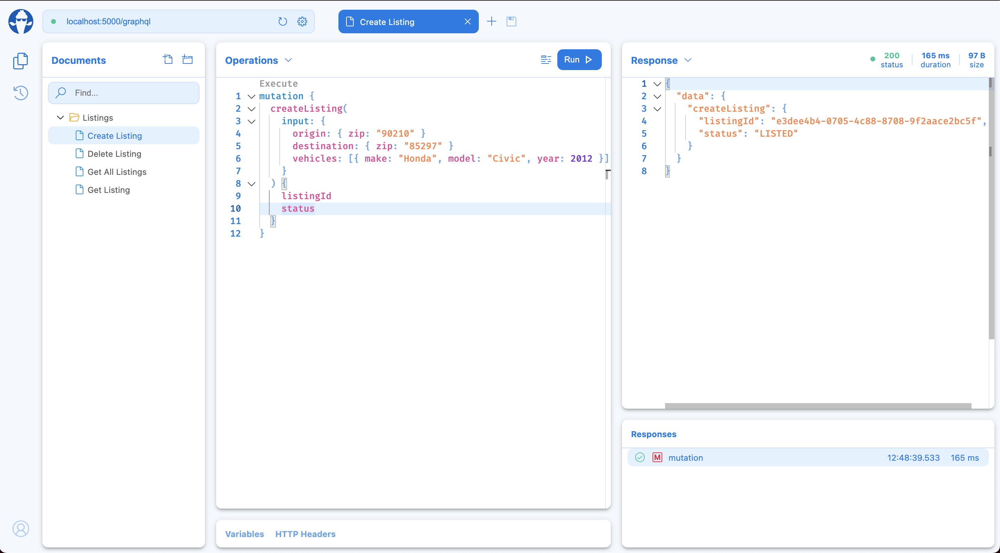
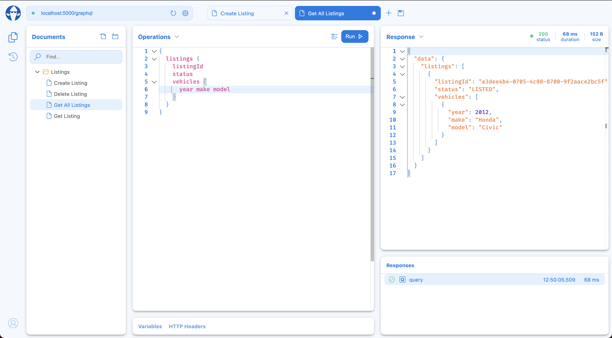

# GraphQl dotnet POC

## About

This is a POC of the following technologies

* GraphQL
* HotChocolate (Dotnet GraphQL library)
* Mediatr
* AutoMapper
* Dynamodb

## Running the project

### Dynamodb

There is a docker-compose.yml file in the root of this project. You will want to run `docker-compose up --build` from that directory.
This will spin up a localstack instance which the application will use for DynamoDb. Note, the localstack startup process contains
a migration that will automatically run and create a Listings table. This may take a few minutes to complete.

### Application

This POC is setup to run from your local machine with dotnet core 3.1. You can simply run  

```dotnet run --project Listings.API```

And then navigate to the graphql playground in your browser

http://localhost:5000/graphql/

## Queries

One nice thing about graphql is it is self documenting. You can view the Schema Definition in the playground that will show you 
queries and mutations that the api exposes.

That said here are a couple of examples

### Create Listing Mutation

```
mutation {
  createListing(
    input: {
      origin: { zip: "90210" }
      destination: { zip: "85297" }
      vehicles: [{ make: "Honda", model: "Civic", year: 2012 }]
    }
  ) {
    listingId
    status
  }
}
```



### Get Listings

```
{
  listings {
    listingId
    status
    vehicles {
      year make model
    }
  }
}
```

